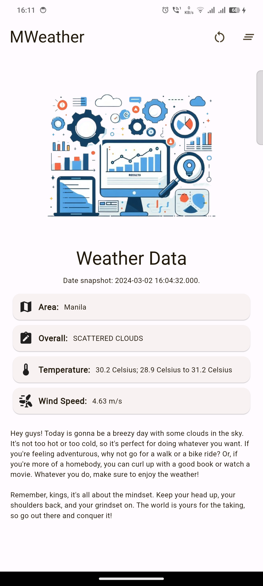

# mweather

A simple weather app that gives a motivational message.

## Building
You won't be able to build this without creating an `api.dart` in `lib/` and putting the appropriate variable for api usage in google's AI.

## Screenshots

